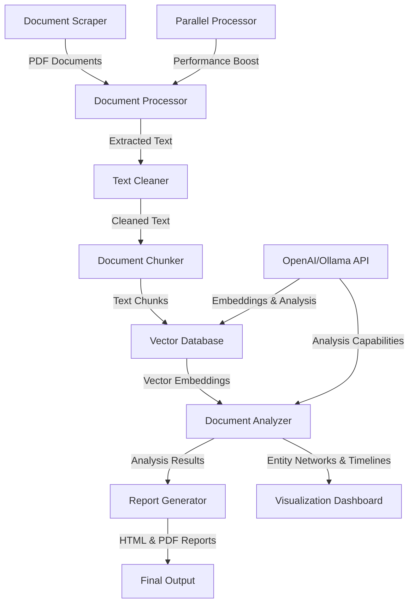

# JFKReveal 🔍

**Uncover the Truth: Declassified JFK Assassination Documents Analysis**

JFKReveal is a powerful tool that analyzes over 1,100 declassified documents from the National Archives to uncover evidence about the JFK assassination. It uses advanced AI techniques and RAG (Retrieval Augmented Generation) to provide comprehensive analysis and insights.

## 📋 Features

- **Automated Document Collection**: Scrapes ALL PDF documents from the National Archives JFK Release 2025 collection.
- **Advanced Text Extraction**: Processes PDFs to extract text with page references and metadata.
- **Intelligent OCR Text Cleaning**: Automatically cleans and normalizes text from scanned documents.
- **Parallel Document Processing**: Significantly speeds up document processing using multiprocessing.
- **Enhanced Document Analysis**: Advanced entity recognition and relationship mapping to uncover connections.
- **Semantic Search**: Hybrid retrieval combining vector search with BM25 and reranking for more accurate results.
- **Interactive Visualization Dashboard**: Explore entity networks, timelines, and key findings visually.
- **AI-Powered Analysis**: Leverages OpenAI models to analyze document content for key information.
- **Comprehensive Reports**: Generates detailed reports on findings, suspects, and potential coverups.
- **Evidence-Based Conclusions**: Presents the most likely explanations based on document evidence.
- **Enhanced Testing Framework**: Includes property-based testing and benchmarks.

## 🚀 Quick Start

### Prerequisites

- Python 3.8+ installed
- OpenAI API key
- Ollama (optional for local embeddings)

### Installation

Clone the repository and set up the environment:

```bash
# Clone the repository
git clone https://github.com/PimpMyNines/JFKReveal.git
cd JFKReveal

# Set up virtual environment and install dependencies
make setup

# Configure your OpenAI API key
cp .env.example .env
# Edit the .env file and add your OpenAI API key

# Install the package
make install-dev
```

### Running the Analysis

To run the complete analysis pipeline:

```bash
make run
```

This will:
1. Download all PDF documents from the National Archives
2. Process the documents and extract text using parallel processing
3. Clean the OCR text to improve quality
4. Create a vector database for efficient searching
5. Analyze the documents using enhanced entity recognition
6. Generate comprehensive reports
7. Launch the interactive visualization dashboard

The final report will be available at `data/reports/full_report.html`.

### Options

Skip certain pipeline steps if needed:

```bash
# Skip the document scraping (if you already have the PDFs)
make run SKIP_SCRAPING=1

# Skip document processing (if PDFs are already processed)
make run SKIP_PROCESSING=1

# Disable text cleaning (if you want to use raw OCR text)
make run NO_CLEAN_TEXT=1
```

## 🧪 Testing

JFKReveal includes a comprehensive test suite to ensure reliability and correctness:

```bash
# Run all unit tests with coverage reporting
./run_tests.sh

# Run only unit tests
python -m pytest tests/ -v -m "not integration and not e2e"

# Run integration tests
python -m pytest tests/ -v -m "integration"

# Run end-to-end tests (requires more setup)
export RUN_E2E=1
python -m pytest tests/ -v -m "e2e"
```

### Test Categories

- **Unit Tests**: Test individual components in isolation (90%+ coverage)
- **Integration Tests**: Verify interactions between components
- **End-to-End Tests**: Test the complete application workflow

### Coverage Requirements

The codebase maintains a minimum of 90% test coverage, enforced in the CI pipeline.
Coverage reports are generated in HTML format in the `htmlcov/` directory.

### Continuous Integration

GitHub Actions automatically runs the test suite on each push and pull request,
ensuring code quality and preventing regressions.

## 📊 Understanding the Results

The analysis produces several detailed reports and visualizations:

- **Interactive Dashboard**: Explore entity networks, event timelines, and document connections visually
- **Executive Summary**: High-level overview of key findings
- **Detailed Analysis**: In-depth examination of all evidence
- **Suspects Analysis**: Evaluation of potential culprits with supporting evidence
- **Coverup Analysis**: Assessment of potential government involvement or information suppression
- **Entity Network Graph**: Visual representation of connections between people, organizations, and locations

All reports include document references, supporting evidence, and confidence levels for each conclusion.

## 🧠 How It Works

JFKReveal follows a sophisticated pipeline:

1. **Document Collection**: Scrapes PDF documents from the National Archives website
2. **Parallel Text Extraction**: Processes PDFs to extract text with page numbers and metadata using multiprocessing
3. **OCR Text Cleaning**: Cleans and normalizes text from scanned documents
4. **Chunking & Vectorization**: Splits documents into manageable chunks and creates vector embeddings
5. **Advanced Entity Recognition**: Identifies people, organizations, locations, and events mentioned in documents
6. **Relationship Mapping**: Maps connections between entities based on co-occurrence and context
7. **Hybrid Semantic Search**: Combines vector embeddings with BM25 for more accurate document retrieval
8. **Topic Analysis**: Analyzes documents for specific topics, individuals, and events
9. **Interactive Visualization**: Enables exploration of entity networks, timelines, and findings
10. **Report Generation**: Synthesizes findings into comprehensive reports

The system supports both Ollama (local) and OpenAI embeddings for vectorization, and uses GPT-4o for analysis.

## 🏗️ Architecture



### Component Breakdown

| Component | Purpose | Technologies |
|-----------|---------|--------------|
| Document Scraper | Download PDFs from National Archives | Python Requests, BeautifulSoup |
| Document Processor | Extract text from PDFs | PyPDF2, PyMuPDF, Parallel Processing |
| Text Cleaner | Clean and normalize OCR text | Regex, NLP techniques |
| Vector Database | Store and query document embeddings | ChromaDB, Hybrid BM25/Vector Search |
| Document Analyzer | Analyze content with AI | OpenAI GPT-4o, LangChain, spaCy |
| Entity Recognizer | Extract people, organizations, locations | spaCy, Custom Rules |
| Visualization Dashboard | Interactive data exploration | Dash, Plotly, NetworkX |
| Report Generator | Create comprehensive reports | Jinja2, HTML/CSS |

## 🔍 Use Cases

### Historical Research

```python
from jfkreveal.search import DocumentSearcher

# Initialize the searcher
searcher = DocumentSearcher()

# Search for specific topics with improved hybrid search
oswald_documents = searcher.search_documents("Lee Harvey Oswald connections to CIA")

# Get detailed entity analysis
from jfkreveal.analysis import EnhancedDocumentAnalyzer
analyzer = EnhancedDocumentAnalyzer()
entity_network = analyzer.analyze_entity_relationships(oswald_documents)

print(entity_network["central_entities"])
```

### Entity Network Visualization

```python
from jfkreveal.visualization import JFKDashboard

# Initialize the dashboard
dashboard = JFKDashboard(data_dir="data/analysis")

# Launch the interactive dashboard
dashboard.run()
```

### Document Timeline Creation

```python
from jfkreveal.timeline import EventTimeline

# Create a timeline of events
timeline = EventTimeline()

# Add relevant documents
timeline.add_documents_by_date_range("1963-11-20", "1963-11-24")

# Export timeline
timeline.export_to_html("assassination_timeline.html")
```

## 🛠️ Configuration

Key configuration options:

- **OpenAI API Key**: Set in the `.env` file (copy from `.env.example`)
- **Embedding Provider**: Set in `.env` file (`ollama` or `openai`, defaults to `ollama`)
- **Ollama Embedding Model**: Configure in `.env` file (defaults to `nomic-embed-text`)
- **Ollama Base URL**: Configure in `.env` file (defaults to `http://localhost:11434`)
- **OpenAI Embedding Model**: Configure in `.env` file (used when provider is set to `openai`)
- **Analysis Model**: Configure in `.env` file (defaults to `gpt-4o`)
- **Parallelization**: Configure max workers in `document_processor.py`
- **Chunking Parameters**: Adjust chunk size and overlap in `document_processor.py`
- **Text Cleaning**: Configure cleaning options in `text_cleaner.py`
- **Analysis Topics**: Modify topics list in `document_analyzer.py`
- **Dashboard Settings**: Configure host/port in visualization module

## 📚 Documentation

For more detailed documentation:

- [API Reference](docs/API_REFERENCE.md)
- [Configuration Guide](docs/CONFIGURATION.md)
- [Technical Architecture](docs/ARCHITECTURE.md)
- [Live Reports](https://pimpmynines.github.io/JFKReveal/)

## 📄 License

This project is licensed under the MIT License - see the [LICENSE](LICENSE) file for details.

## 🛠️ Code Structure and Refactoring

The project codebase follows modern software engineering practices:

### Modular Design
- Each component is isolated with well-defined interfaces
- Dependencies are explicitly injected for better testability
- Shared utilities centralized to avoid code duplication

### Recent Improvements
- **Code Duplication Reduction**: Extracted common file operations into `file_utils.py`
- **Dependency Injection**: Implemented a lightweight DI container
- **Error Handling**: Enhanced error hierarchy with specific exception types
- **CLI Interface**: Modern command-line interface with subcommands

### Upcoming Refactoring
- **Template Management**: Moving HTML templates to dedicated directory
- **Prompt Management**: Centralizing LLM prompts
- **Progress Tracking**: Unified progress tracking system

## ⚠️ Disclaimer

This tool is designed for educational and research purposes only. The analysis presents evidence-based conclusions but should not be considered definitive. All findings should be critically evaluated alongside other historical research.

## 🙏 Acknowledgments

- National Archives for making these documents available
- OpenAI for providing the AI capabilities
- LangChain and ChromaDB for vector search functionality
- All contributors who have helped improve this project