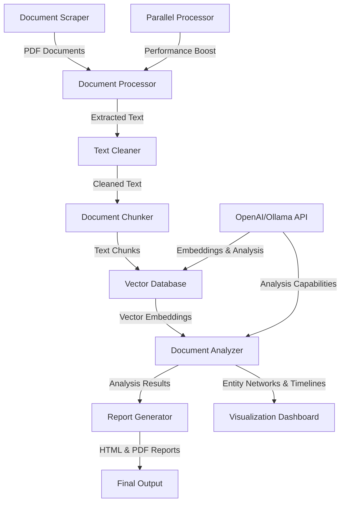

# JFKReveal Technical Architecture

This document provides a detailed overview of the JFKReveal system architecture, including component interactions, data flow, design patterns, and implementation details.

## Table of Contents
- [System Overview](#system-overview)
- [Component Architecture](#component-architecture)
- [Data Flow](#data-flow)
- [Technical Design](#technical-design)
- [Dependency Management](#dependency-management)
- [Error Handling](#error-handling)
- [Performance Considerations](#performance-considerations)
- [Testing Strategy](#testing-strategy)
- [Security Considerations](#security-considerations)
- [Future Architecture Considerations](#future-architecture-considerations)

## System Overview

JFKReveal is a comprehensive document analysis system designed to process, analyze, and extract insights from declassified JFK assassination documents. The system follows a pipeline architecture with clearly defined stages:

1. **Document Collection**: Scraping PDF documents from the National Archives
2. **Document Processing**: Extracting and cleaning text from PDFs
3. **Vectorization**: Creating embeddings for semantic search
4. **Analysis**: Analyzing document content using LLMs
5. **Reporting**: Generating comprehensive reports from analysis
6. **Visualization**: Providing interactive visualizations of findings

### Architecture Diagram



## Component Architecture

### Core Components

Each component in JFKReveal is designed with a clear separation of concerns and well-defined interfaces:

#### 1. Document Scraper (`scrapers/archives_gov.py`)

**Responsibility**: Downloads PDF documents from the National Archives with robust retry mechanisms.

**Key Interfaces**:
- `download_documents()`: Main entry point for document retrieval
- `get_document_urls()`: Retrieves available document URLs
- `download_document()`: Downloads a specific document

**Design Patterns**:
- Utilizes the Template Method pattern for the document retrieval process
- Implements Retry pattern using the `backoff` library for resilient downloads

#### 2. Document Processor (`database/document_processor.py`)

**Responsibility**: Extracts text from PDFs, applies OCR when needed, and chunks documents for analysis.

**Key Interfaces**:
- `process_document()`: Processes a single document
- `process_documents()`: Processes multiple documents in parallel
- `extract_text_from_pdf()`: Extracts text from PDF files
- `apply_ocr_to_page()`: Applies OCR to image-based pages
- `chunk_document()`: Splits documents into manageable chunks

**Design Patterns**:
- Uses Strategy pattern for text extraction methods (direct vs. OCR)
- Implements Factory pattern for creating document processing pipelines

#### 3. Text Cleaner (`database/text_cleaner.py`)

**Responsibility**: Cleans and normalizes text, especially from OCR sources.

**Key Interfaces**:
- `clean_text()`: Main entry point for text normalization
- `fix_typewriter_artifacts()`: Handles typewriter-specific issues
- `normalize_terms()`: Normalizes domain-specific terminology

**Design Patterns**:
- Uses Chain of Responsibility for sequential text cleaning steps
- Implements Strategy pattern for different document types

#### 4. Vector Store (`database/vector_store.py`)

**Responsibility**: Manages document embeddings and provides semantic search.

**Key Interfaces**:
- `add_documents()`: Adds documents to the vector store
- `semantic_search()`: Performs vector-based search
- `hybrid_search()`: Combines vector search with BM25

**Design Patterns**:
- Uses Adapter pattern to provide uniform interface across embedding backends
- Implements Repository pattern for persistent storage

#### 5. Document Analyzer (`analysis/document_analyzer.py`)

**Responsibility**: Analyzes document content using LLMs and structured outputs.

**Key Interfaces**:
- `analyze_documents()`: Performs comprehensive document analysis
- `analyze_topic()`: Analyzes specific topics within documents
- `extract_entities()`: Identifies entities mentioned in documents

**Design Patterns**:
- Uses Command pattern for different analysis tasks
- Implements Factory method for creating analysis chains

#### 6. Findings Report (`summarization/findings_report.py`)

**Responsibility**: Generates comprehensive reports from analysis results.

**Key Interfaces**:
- `generate_executive_summary()`: Creates high-level summary
- `generate_detailed_findings()`: Creates detailed analysis report
- `generate_full_report()`: Creates comprehensive report

**Design Patterns**:
- Uses Template method for report generation
- Implements Builder pattern for report construction

#### 7. Dashboard (`visualization/dashboard.py`)

**Responsibility**: Provides interactive visualizations of analysis results.

**Key Interfaces**:
- `run()`: Launches the interactive dashboard
- `create_entity_network()`: Creates network visualization
- `create_timeline()`: Creates timeline visualization

**Design Patterns**:
- Uses Observer pattern for interactive components
- Implements Factory for creating different visualizations

### Utility Components

#### Parallel Processor (`utils/parallel_processor.py`)

**Responsibility**: Provides parallel processing capabilities.

**Key Interfaces**:
- `process()`: Processes items in parallel
- `map()`: Maps function over items in parallel

**Design Patterns**:
- Uses Facade pattern to simplify parallel processing
- Implements Strategy for choosing between thread and process pools

#### File Utils (`utils/file_utils.py`)

**Responsibility**: Centralizes file operations.

**Key Interfaces**:
- `ensure_dir_exists()`: Creates directories if needed
- `save_json()`: Saves data to JSON file
- `load_json()`: Loads data from JSON file

**Design Patterns**:
- Implements Utility class pattern
- Uses Static methods for stateless operations

#### Logger (`utils/logger.py`)

**Responsibility**: Provides centralized logging functionality.

**Key Interfaces**:
- `get_logger()`: Gets logger for specific module
- `set_log_level()`: Sets logging level
- `log_execution_time()`: Decorator for performance logging

**Design Patterns**:
- Uses Singleton pattern for logger instances
- Implements Decorator pattern for logging aspects

## Data Flow

The data flow through the JFKReveal system is designed for efficiency and traceability:

### 1. Document Collection Phase

```
National Archives Website → PDF Documents → Local Storage
```

**Data Format**: PDF files stored in the `data/pdfs` directory.

**Key Transformations**:
- Web scraping to identify document URLs
- HTTP requests to download PDF documents
- Local storage with proper naming and organization

### 2. Document Processing Phase

```
PDF Documents → Extracted Text → Cleaned Text → Document Chunks
```

**Data Format**: 
- Input: PDF files
- Output: JSON files with extracted text, metadata, and chunk information

**Key Transformations**:
- PDF text extraction (with PyMuPDF)
- OCR for image-based pages (with pytesseract)
- Text cleaning and normalization
- Document chunking with overlap

### 3. Vectorization Phase

```
Document Chunks → Embeddings → Vector Database
```

**Data Format**:
- Input: Chunked text documents
- Output: Vector embeddings in ChromaDB

**Key Transformations**:
- Embedding generation (OpenAI or Ollama)
- Vector storage and indexing
- Metadata association with vectors

### 4. Analysis Phase

```
Document Chunks + Vector Database → LLM Analysis → Structured Analysis Data
```

**Data Format**:
- Input: Document chunks and search results
- Output: Structured JSON data with analysis results

**Key Transformations**:
- Semantic search for relevant documents
- LLM-based analysis using structured output
- Entity extraction and relationship mapping
- Topic-specific analysis

### 5. Reporting and Visualization Phase

```
Analysis Data → Report Generation → HTML/Markdown Reports
Analysis Data → Dashboard Generation → Interactive Visualizations
```

**Data Format**:
- Input: Structured analysis JSON
- Output: HTML/Markdown reports and interactive dashboard

**Key Transformations**:
- Template-based report generation
- Entity network visualization
- Timeline creation
- Interactive dashboard components

## Technical Design

### Dependency Injection

JFKReveal implements a lightweight dependency injection system to improve testability and modularity:

```python
# Interface definition using Protocol
from typing import Protocol, List, Dict, Type

class VectorStoreProtocol(Protocol):
    def add_documents(self, documents: List[Dict]) -> None: ...
    def semantic_search(self, query: str, k: int = 10) -> List[Dict]: ...

# Container implementation
class DIContainer:
    def __init__(self):
        self._services = {}
        self._factories = {}

    def register(self, name: str, implementation: Type) -> None:
        self._services[name] = implementation

    def register_factory(self, name: str, factory: callable) -> None:
        self._factories[name] = factory

    def resolve(self, name: str) -> object:
        if name in self._services:
            return self._services[name]()
        elif name in self._factories:
            return self._factories[name]()
        raise KeyError(f"No service registered for {name}")

# Usage example
class JFKReveal:
    def __init__(self, container=None):
        self.container = container or DIContainer()
        self.vector_store = self.container.resolve("vector_store")
```

### Model Integration

Integration with language models is handled through structured chains with defined input/output schemas:

```python
from langchain.pydantic_v1 import BaseModel, Field
from langchain.prompts import ChatPromptTemplate
from langchain.output_parsers.openai_functions import JsonOutputFunctionsParser
from langchain.chat_models import ChatOpenAI

# Output schema
class TopicAnalysis(BaseModel):
    summary: str = Field(description="Summary of the topic")
    key_findings: List[str] = Field(description="Key findings about the topic")
    evidence_strength: str = Field(description="Strength of the evidence (strong, moderate, weak)")
    credibility: float = Field(description="Credibility score from 0.0 to 1.0")

# Chain creation
def create_analysis_chain(model_name: str, api_key: str = None):
    prompt = ChatPromptTemplate.from_template("""
    Analyze the following documents about {topic}.
    
    Documents:
    {documents}
    
    Provide a thorough analysis including key findings and evidence strength.
    """)
    
    model = ChatOpenAI(
        model=model_name,
        openai_api_key=api_key,
        temperature=0.0
    )
    
    chain = (
        prompt
        | model.bind_functions(functions=[TopicAnalysis.schema()])
        | JsonOutputFunctionsParser()
    )
    
    return chain
```

### Text Extraction and OCR

The text extraction system uses a hybrid approach with direct extraction and OCR fallback:

```python
def extract_text_from_pdf(self, pdf_path: str) -> Dict:
    """Extract text from PDF with OCR fallback."""
    document = {"text": "", "pages": [], "metadata": {}}
    
    # Load PDF
    pdf_document = fitz.open(pdf_path)
    document["metadata"] = self._extract_metadata(pdf_document)
    
    # Track OCR statistics
    ocr_page_count = 0
    total_pages = len(pdf_document)
    
    for page_num, page in enumerate(pdf_document):
        page_text = page.get_text()
        
        # Check if OCR is needed (text is too short or empty)
        if len(page_text.strip()) < 100 and self.use_ocr:
            # Convert page to image
            pix = page.get_pixmap(matrix=fitz.Matrix(self.ocr_resolution, self.ocr_resolution))
            img = Image.frombytes("RGB", [pix.width, pix.height], pix.samples)
            
            # Apply OCR
            page_text = self.apply_ocr_to_page(img)
            ocr_page_count += 1
        
        # Clean text if needed
        if self.clean_text:
            page_text = self.text_cleaner.clean_text(page_text)
        
        document["pages"].append({
            "page_num": page_num + 1,
            "text": page_text
        })
        document["text"] += page_text + "\n\n"
    
    # Add OCR statistics
    document["metadata"]["ocr_percentage"] = ocr_page_count / total_pages if total_pages > 0 else 0
    document["metadata"]["ocr_page_count"] = ocr_page_count
    document["metadata"]["total_pages"] = total_pages
    
    return document
```

### Vector Search Implementation

The search system implements a hybrid approach combining vector search with BM25:

```python
def hybrid_search(self, query: str, k: int = 10) -> List[Dict]:
    """Perform hybrid search combining vector and BM25 approaches."""
    # Get vector search results
    vector_results = self.vector_search(query, k=k*2)
    
    # Get BM25 results
    bm25_results = self.bm25_search(query, k=k*2)
    
    # Combine results with weights
    vector_weight = 0.7
    bm25_weight = 0.3
    
    # Create a map of document_id to combined score
    combined_scores = {}
    
    # Normalize and add vector scores
    max_vector_score = max([r["score"] for r in vector_results]) if vector_results else 1.0
    for result in vector_results:
        doc_id = result["document"]["id"]
        normalized_score = result["score"] / max_vector_score
        combined_scores[doc_id] = vector_weight * normalized_score
    
    # Normalize and add BM25 scores
    max_bm25_score = max([r["score"] for r in bm25_results]) if bm25_results else 1.0
    for result in bm25_results:
        doc_id = result["document"]["id"]
        normalized_score = result["score"] / max_bm25_score
        if doc_id in combined_scores:
            combined_scores[doc_id] += bm25_weight * normalized_score
        else:
            combined_scores[doc_id] = bm25_weight * normalized_score
    
    # Get all unique documents
    all_docs = {r["document"]["id"]: r["document"] for r in vector_results + bm25_results}
    
    # Create combined results
    combined_results = [
        {"document": all_docs[doc_id], "score": score}
        for doc_id, score in sorted(combined_scores.items(), key=lambda x: x[1], reverse=True)
    ]
    
    # Apply re-ranking if a reranker is configured
    if self.reranker:
        combined_results = self._rerank_results(query, combined_results[:k*2])
    
    return combined_results[:k]
```

## Dependency Management

### External Dependencies

JFKReveal uses several key external libraries:

1. **Document Processing**:
   - PyMuPDF (fitz): PDF processing
   - pytesseract: OCR for image-based documents
   - Pillow: Image processing for OCR

2. **Data Storage and Search**:
   - ChromaDB: Vector database for document embeddings
   - rank_bm25: BM25 implementation for text search

3. **AI and Analysis**:
   - LangChain: Framework for LLM integration
   - OpenAI: API for embeddings and language models
   - spaCy: NLP for entity extraction

4. **Visualization and Reporting**:
   - Dash/Plotly: Interactive visualizations
   - Jinja2: Template rendering for reports
   - Markdown: Report generation

5. **Utility Libraries**:
   - backoff: Retry logic with exponential backoff
   - tenacity: Advanced retry patterns
   - Pydantic: Data validation and settings management
   - tqdm: Progress bars
   - python-dotenv: Environment variable management

### Dependency Injection

The dependency injection system allows for flexible component substitution:

```python
# Sample container setup
container = DIContainer()

# Register core components
container.register("document_processor", DocumentProcessor)
container.register("text_cleaner", TextCleaner)
container.register("vector_store", VectorStore)
container.register("document_analyzer", DocumentAnalyzer)
container.register("findings_report", FindingsReport)

# Register factories for components that need configuration
container.register_factory("openai_client", lambda: create_openai_client())

# Create application with container
app = JFKReveal(container=container)
```

### Credential Management

The credential management system supports multiple providers and rotation:

```python
class CredentialProvider:
    def __init__(self, sources=None):
        self.sources = sources or [
            MemoryCredentialSource(),
            EnvCredentialSource(),
            FileCredentialSource()
        ]
        self.current_index = 0
        
    def get_credential(self, name: str) -> str:
        """Get credential from the first available source."""
        for source in self.sources:
            credential = source.get_credential(name)
            if credential:
                return credential
        return None
    
    def rotate_credential(self, name: str) -> str:
        """Rotate to the next available credential."""
        if isinstance(self.sources[-1], FileCredentialSource):
            return self.sources[-1].rotate_credential(name)
        return None
```

## Error Handling

JFKReveal implements a comprehensive error handling strategy:

### Exception Hierarchy

```
BaseException
└── Exception
    └── JFKRevealError
        ├── ConfigurationError
        │   ├── APIKeyError
        │   ├── ModelNotFoundError
        │   └── InvalidConfigurationError
        ├── ProcessingError
        │   ├── DocumentProcessingError
        │   ├── OCRError
        │   └── ChunkingError
        ├── StorageError
        │   ├── VectorStoreError
        │   └── PersistenceError
        ├── AnalysisError
        │   ├── LLMError
        │   │   ├── TokenLimitExceededError
        │   │   ├── ModelUnavailableError
        │   │   └── InvalidOutputError
        │   └── StructuredOutputError
        ├── ReportGenerationError
        │   ├── TemplateRenderingError
        │   └── OutputFormattingError
        └── IntegrationError
            ├── APIError
            │   ├── RateLimitExceededError
            │   ├── AuthenticationError
            │   └── ServiceUnavailableError
            └── ExternalDependencyError
```

### Error Recovery Mechanisms

The system implements several error recovery patterns:

1. **Circuit Breaker Pattern**: Prevents repeated failures by temporarily disabling components:

```python
class CircuitBreaker:
    def __init__(self, failure_threshold=5, reset_timeout=300):
        self.failure_count = 0
        self.failure_threshold = failure_threshold
        self.reset_timeout = reset_timeout
        self.last_failure_time = 0
        self.state = "CLOSED"  # CLOSED, OPEN, HALF_OPEN
        
    def execute(self, function, *args, **kwargs):
        current_time = time.time()
        
        # Check if circuit should be reset
        if self.state == "OPEN" and current_time - self.last_failure_time > self.reset_timeout:
            self.state = "HALF_OPEN"
        
        # Execute if circuit is closed or half-open
        if self.state != "OPEN":
            try:
                result = function(*args, **kwargs)
                
                # Success in half-open state closes the circuit
                if self.state == "HALF_OPEN":
                    self.state = "CLOSED"
                    self.failure_count = 0
                    
                return result
            except Exception as e:
                self.last_failure_time = current_time
                self.failure_count += 1
                
                # Open circuit if threshold reached
                if self.failure_count >= self.failure_threshold:
                    self.state = "OPEN"
                    
                raise e
        else:
            raise CircuitOpenError("Circuit is open, request not attempted")
```

2. **Automatic Credential Rotation**: Handles rate limit errors by switching API keys:

```python
@retry(
    stop=stop_after_attempt(3),
    wait=wait_exponential(multiplier=1, min=4, max=60),
    retry=retry_if_exception_type(RateLimitExceededError),
    before_sleep=before_sleep_log(logger, logging.WARNING),
    after=after_log(logger, logging.INFO)
)
def handle_llm_request_with_rotation(self, function, *args, **kwargs):
    try:
        return function(*args, **kwargs)
    except RateLimitExceededError:
        # Rotate API key
        new_key = self.credential_provider.rotate_credential("openai_api_key")
        if new_key:
            # Update client with new key
            if "openai_api_key" in kwargs:
                kwargs["openai_api_key"] = new_key
            # Retry with new key
            return function(*args, **kwargs)
        else:
            # No more keys available, re-raise
            raise
```

3. **Fallback Mechanisms**: Gracefully degrade when primary components fail:

```python
def analyze_with_fallback(self, documents, model_name):
    """Analyze documents with fallback to simpler models if needed."""
    try:
        # Try primary model
        return self._analyze_with_model(documents, model_name)
    except (ModelUnavailableError, TokenLimitExceededError) as e:
        logger.warning(f"Primary model failed: {e}. Trying fallback model.")
        try:
            # Try fallback model
            return self._analyze_with_model(documents, self.fallback_model)
        except Exception as fallback_error:
            logger.error(f"Fallback model failed: {fallback_error}")
            # Generate basic analysis without LLM
            return self._generate_basic_analysis(documents)
```

## Performance Considerations

### Parallel Processing

The system implements efficient parallel processing:

```python
class ParallelProcessor:
    def __init__(self, max_workers=None, use_threads=False):
        self.max_workers = max_workers
        self.use_threads = use_threads
        self._executor_class = ThreadPoolExecutor if use_threads else ProcessPoolExecutor
        
    def process(self, items, function, *args, **kwargs):
        """Process items in parallel using the provided function."""
        results = []
        total = len(items)
        
        with self._executor_class(max_workers=self.max_workers) as executor:
            futures = {
                executor.submit(function, item, *args, **kwargs): i 
                for i, item in enumerate(items)
            }
            
            for future in tqdm(as_completed(futures), total=total, desc="Processing"):
                try:
                    result = future.result()
                    results.append(result)
                except Exception as e:
                    logger.error(f"Error processing item: {e}")
                    results.append(None)
        
        # Ensure results are in the correct order
        return [
            result for _, result in sorted(
                zip([futures[future] for future in futures], results),
                key=lambda pair: pair[0]
            )
        ]
```

### Memory Optimization

For handling large document collections, memory optimization is implemented:

```python
class LowMemoryDocumentProcessor(DocumentProcessor):
    """Memory-optimized document processor for large collections."""
    
    def process_documents(self, pdf_paths):
        """Process documents with controlled memory usage."""
        results = []
        # Process in smaller batches to control memory usage
        batch_size = min(len(pdf_paths), self.batch_size)
        
        for i in range(0, len(pdf_paths), batch_size):
            batch = pdf_paths[i:i+batch_size]
            batch_results = super().process_documents(batch)
            results.extend(batch_results)
            
            # Force garbage collection after each batch
            gc.collect()
            
        return results
```

### Caching Strategy

Efficient caching reduces redundant operations:

```python
class CachedVectorStore(VectorStore):
    """Vector store with caching for improved performance."""
    
    def __init__(self, *args, **kwargs):
        super().__init__(*args, **kwargs)
        self.embedding_cache = {}
        self.cache_ttl = kwargs.get('cache_ttl', 86400)  # 1 day default
        
    def get_embedding(self, text):
        """Get embedding with caching."""
        cache_key = hashlib.md5(text.encode()).hexdigest()
        
        # Check cache
        if cache_key in self.embedding_cache:
            cached_time, embedding = self.embedding_cache[cache_key]
            # Check if still valid
            if time.time() - cached_time < self.cache_ttl:
                return embedding
        
        # Generate new embedding
        embedding = super().get_embedding(text)
        
        # Cache the result
        self.embedding_cache[cache_key] = (time.time(), embedding)
        
        return embedding
```

## Testing Strategy

JFKReveal implements a comprehensive testing strategy:

### Test Types

1. **Unit Tests**: Test individual components in isolation
   - Location: `tests/unit/`
   - Focus: Individual functions and classes
   - Coverage target: 90%+

2. **Integration Tests**: Test component interactions
   - Location: `tests/integration/`
   - Focus: Interactions between components
   - Coverage: Key integration points

3. **End-to-End Tests**: Test complete workflows
   - Location: `tests/e2e/`
   - Focus: Complete user workflows
   - Environment: Requires configuration for external services

### Test Fixtures

Reusable fixtures for different test scenarios:

```python
# conftest.py

@pytest.fixture
def mock_pdf_document():
    """Create a mock PDF document for testing."""
    # Create a simple PDF with predictable content
    with fitz.open() as doc:
        page = doc.new_page()
        page.insert_text((50, 50), "Test Document Content")
        page.insert_text((50, 70), "Second line of text")
        
        # Save to temporary file
        temp_file = tempfile.NamedTemporaryFile(suffix=".pdf", delete=False)
        doc.save(temp_file.name)
    
    yield temp_file.name
    
    # Cleanup
    os.unlink(temp_file.name)

@pytest.fixture
def mock_openai_response():
    """Create a mock OpenAI response."""
    return {
        "id": "mock-id",
        "object": "chat.completion",
        "created": int(time.time()),
        "model": "gpt-4",
        "choices": [{
            "message": {
                "role": "assistant",
                "content": "Mock response content"
            },
            "index": 0,
            "finish_reason": "stop"
        }]
    }

@pytest.fixture
def vector_store_fixture():
    """Provides a pre-configured vector store for testing."""
    # Create a temporary collection
    store = VectorStore(
        collection_name=f"test_collection_{uuid.uuid4().hex[:8]}",
        embedding_provider="mock"
    )
    
    # Add some test documents
    store.add_documents([
        {"id": "doc1", "text": "This is a test document about Kennedy", "metadata": {"source": "test"}},
        {"id": "doc2", "text": "This document mentions Oswald and conspiracy", "metadata": {"source": "test"}},
        {"id": "doc3", "text": "The Warren Commission investigated the assassination", "metadata": {"source": "test"}}
    ])
    
    yield store
    
    # Cleanup
    store.delete_collection()
```

### Mock Integration

Sophisticated mocking for external dependencies:

```python
class MockOpenAI:
    """Mock OpenAI client for testing."""
    
    def __init__(self, *args, **kwargs):
        self.api_key = kwargs.get("api_key", "mock-key")
        self.model = kwargs.get("model", "gpt-4")
        self.calls = []
        
    def create(self, model, messages, **kwargs):
        """Mock completion creation."""
        self.calls.append({
            "model": model,
            "messages": messages,
            "kwargs": kwargs
        })
        
        # Return structured content based on the prompt
        prompt = messages[-1]["content"].lower()
        if "summary" in prompt:
            return self._create_summary_response()
        elif "entity" in prompt:
            return self._create_entity_response()
        else:
            return self._create_default_response()
            
    def _create_summary_response(self):
        """Create a mock summary response."""
        return {
            "id": "mock-id",
            "object": "chat.completion",
            "created": int(time.time()),
            "model": self.model,
            "choices": [{
                "message": {
                    "role": "assistant",
                    "content": "This is a mock summary of the document analysis.",
                    "function_call": {
                        "name": "TopicSummary",
                        "arguments": json.dumps({
                            "summary": "Mock summary content",
                            "key_findings": ["Finding 1", "Finding 2"],
                            "evidence_strength": "moderate",
                            "credibility": 0.75
                        })
                    }
                },
                "index": 0,
                "finish_reason": "function_call"
            }]
        }
```

## Security Considerations

JFKReveal implements several security measures:

### API Key Management

API keys are securely managed:

```python
class SecureCredentialStore:
    """Secure storage for API credentials."""
    
    def __init__(self, storage_path=None):
        self.storage_path = storage_path or os.path.expanduser("~/.jfkreveal/credentials")
        os.makedirs(os.path.dirname(self.storage_path), exist_ok=True, mode=0o700)
        
    def save_credential(self, name, value):
        """Save credential securely."""
        # Encrypt before saving (simplified for illustration)
        encrypted = self._encrypt(value)
        
        # Save to file with restricted permissions
        path = os.path.join(self.storage_path, f"{name}.enc")
        with open(path, "wb") as f:
            f.write(encrypted)
        os.chmod(path, 0o600)  # Only user can read/write
        
    def get_credential(self, name):
        """Get credential securely."""
        path = os.path.join(self.storage_path, f"{name}.enc")
        if not os.path.exists(path):
            return None
            
        # Read and decrypt
        with open(path, "rb") as f:
            encrypted = f.read()
        return self._decrypt(encrypted)
        
    def _encrypt(self, value):
        """Encrypt value using system keyring (simplified)."""
        # This would use a proper encryption mechanism
        return value.encode()
        
    def _decrypt(self, encrypted):
        """Decrypt value (simplified)."""
        # This would use a proper decryption mechanism
        return encrypted.decode()
```

### Input Validation

All inputs are validated:

```python
class DocumentValidator:
    """Validates document inputs for security."""
    
    @staticmethod
    def validate_pdf_path(path):
        """Validate PDF path for security."""
        # Check file exists
        if not os.path.exists(path):
            raise ValueError(f"File does not exist: {path}")
            
        # Check file extension
        if not path.lower().endswith('.pdf'):
            raise ValueError(f"File is not a PDF: {path}")
            
        # Check file size
        max_size_mb = 100
        size_mb = os.path.getsize(path) / (1024 * 1024)
        if size_mb > max_size_mb:
            raise ValueError(f"File exceeds maximum size of {max_size_mb}MB: {size_mb:.2f}MB")
            
        # Basic content validation
        try:
            with fitz.open(path) as doc:
                # Ensure it's actually a PDF
                if doc.is_encrypted or doc.needs_pass:
                    raise ValueError("Encrypted PDFs are not supported")
                    
                # Ensure it has content
                if len(doc) == 0:
                    raise ValueError("PDF has no pages")
                    
            return True
        except Exception as e:
            raise ValueError(f"Invalid PDF: {str(e)}")
```

### Output Sanitization

All outputs are sanitized:

```python
class OutputSanitizer:
    """Sanitizes outputs for security."""
    
    @staticmethod
    def sanitize_html(html):
        """Sanitize HTML output."""
        # Use bleach library to sanitize HTML
        allowed_tags = [
            'h1', 'h2', 'h3', 'h4', 'h5', 'h6', 'p', 'br', 'strong', 
            'em', 'u', 'ol', 'ul', 'li', 'a', 'table', 'tr', 'td', 'th',
            'thead', 'tbody', 'span', 'div', 'code', 'pre'
        ]
        allowed_attrs = {
            '*': ['class', 'style'],
            'a': ['href', 'title', 'target'],
            'img': ['src', 'alt', 'title', 'width', 'height'],
        }
        return bleach.clean(html, tags=allowed_tags, attributes=allowed_attrs)
        
    @staticmethod
    def sanitize_markdown(markdown):
        """Sanitize Markdown output."""
        # Convert to HTML and sanitize, then back to Markdown
        html = markdown_to_html(markdown)
        sanitized_html = OutputSanitizer.sanitize_html(html)
        return html_to_markdown(sanitized_html)
        
    @staticmethod
    def sanitize_filename(filename):
        """Sanitize filename."""
        # Remove invalid characters
        valid_chars = "-_.() %s%s" % (string.ascii_letters, string.digits)
        sanitized = ''.join(c for c in filename if c in valid_chars)
        sanitized = sanitized.replace(' ','_')
        return sanitized
```

## Future Architecture Considerations

### Scalability Enhancements

For handling larger document collections:

```python
# Distributed document processing
class DistributedDocumentProcessor:
    """Processes documents across multiple nodes."""
    
    def __init__(self, coordinator_url):
        self.coordinator_url = coordinator_url
        
    def process_documents(self, pdf_paths):
        """Distribute document processing across nodes."""
        # Split work across nodes
        chunks = self._split_into_chunks(pdf_paths)
        results = []
        
        # Submit jobs to worker nodes
        for chunk in chunks:
            job_id = self._submit_job(chunk)
            results.append(self._wait_for_results(job_id))
            
        # Combine results
        return self._combine_results(results)
```

### Modular Plugin Architecture

For extensibility:

```python
# Plugin system for analysis modules
class PluginManager:
    """Manages analysis plugins."""
    
    def __init__(self):
        self.plugins = {}
        
    def register_plugin(self, name, plugin_class):
        """Register a new plugin."""
        self.plugins[name] = plugin_class
        
    def get_plugin(self, name):
        """Get a plugin by name."""
        if name not in self.plugins:
            raise ValueError(f"Plugin not found: {name}")
        return self.plugins[name]()
        
    def discover_plugins(self, plugin_dir):
        """Discover plugins in directory."""
        for file in os.listdir(plugin_dir):
            if file.endswith('.py') and not file.startswith('_'):
                module_name = file[:-3]
                module_path = os.path.join(plugin_dir, file)
                
                # Import module
                spec = importlib.util.spec_from_file_location(module_name, module_path)
                module = importlib.util.module_from_spec(spec)
                spec.loader.exec_module(module)
                
                # Register plugins
                if hasattr(module, 'PLUGINS'):
                    for name, plugin_class in module.PLUGINS.items():
                        self.register_plugin(name, plugin_class)
```

### Real-time Collaboration

For multi-user environments:

```python
# Real-time collaboration server
class CollaborationServer:
    """Enables real-time collaboration on analysis."""
    
    def __init__(self, host, port):
        self.host = host
        self.port = port
        self.clients = {}
        self.document_views = {}
        
    def start(self):
        """Start the collaboration server."""
        # WebSocket server setup
        self.server = websockets.serve(self._handle_client, self.host, self.port)
        asyncio.get_event_loop().run_until_complete(self.server)
        asyncio.get_event_loop().run_forever()
        
    async def _handle_client(self, websocket, path):
        """Handle client connection."""
        client_id = str(uuid.uuid4())
        self.clients[client_id] = websocket
        
        try:
            async for message in websocket:
                data = json.loads(message)
                await self._process_message(client_id, data)
        finally:
            del self.clients[client_id]
            
    async def _process_message(self, client_id, data):
        """Process client message."""
        action = data.get('action')
        
        if action == 'view_document':
            document_id = data.get('document_id')
            self.document_views.setdefault(document_id, set()).add(client_id)
            
        elif action == 'add_annotation':
            document_id = data.get('document_id')
            annotation = data.get('annotation')
            
            # Broadcast to all clients viewing this document
            for viewing_client in self.document_views.get(document_id, set()):
                if viewing_client != client_id:  # Don't send back to originator
                    await self.clients[viewing_client].send(json.dumps({
                        'action': 'new_annotation',
                        'annotation': annotation,
                        'client_id': client_id
                    }))
```